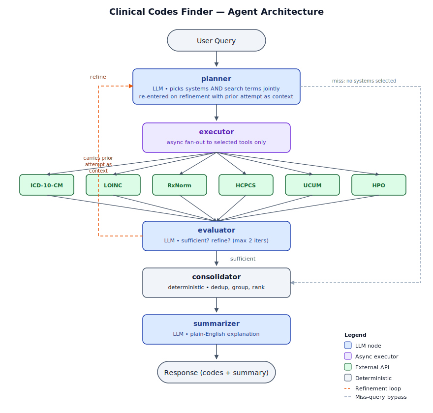

# Clinical Codes Finder

An agentic system that takes a natural-language clinical term and returns relevant codes across six major medical coding systems — **ICD-10-CM**, **LOINC**, **RxNorm**, **HCPCS**, **UCUM**, and **HPO** — with a plain-English explanation of what was found and why.

> 🎬 **Demo video:** [insert link]
> 🚀 **Live demo:** [insert Streamlit Cloud link, optional]

---

## The problem

Clinical data lives across half a dozen incompatible coding systems. A clinician searching for *"blood sugar test"* needs LOINC; a billing team handling *"wheelchair"* needs HCPCS; a pharmacy looking up *"metformin 500 mg"* needs RxNorm. Existing search tools force users to know which system to query before they search.

This project demonstrates an agent that **infers intent**, **routes to the relevant systems**, **executes searches in parallel**, **refines on weak results**, and **explains its reasoning** — all from a single natural-language query.

---

## Architecture



The pipeline is a LangGraph state machine. At its core is a tight **Planner → Executor → Evaluator** loop:

1. **`planner`** — LLM. In a single call, picks which of the 6 coding systems are relevant **and** generates per-system search terms. On refinement, it's re-entered with the prior attempt's results as context, so it can revise both decisions jointly.
2. **`executor`** — Async fan-out. Calls only the selected Clinical Tables APIs concurrently. Per-system failures are isolated.
3. **`evaluator`** — LLM. Inspects results and decides: *sufficient* → forward to consolidation; *weak* → loop back to planner with feedback. Capped at 2 iterations.
4. **`consolidator`** — Deterministic. Dedups, groups by system, ranks by API confidence.
5. **`summarizer`** — LLM. Plain-English explanation with reasoning trace.

### Why this architecture, and not ReAct?

The instinct on agent assignments is to reach for ReAct (think → act → observe in a loop with one LLM). I deliberately chose **Plan-and-Execute with parallel fan-out and a bounded refinement loop** instead:

- **The 6 coding systems are independent.** A search in LOINC has no bearing on a search in HCPCS. ReAct would needlessly serialize them, wasting latency and tokens on coordination the task doesn't need.
- **Most queries resolve in one pass.** The evaluator only triggers refinement when results are empty or semantically irrelevant to the query — not on every query. This keeps the median path cheap.
- **Per-system fan-out gives clean traces.** Each tool call is a separate observable unit, easier to debug and evaluate than a single agent juggling 6 tools through one prompt.
- **The loop is bounded (max 2 iterations).** Unbounded refinement is where agents go to die. The cap is enforced in graph state, not prompted into the LLM.

### Scaling beyond 6 systems
The current implementation embeds system descriptions directly in the planner prompt — appropriate for 6 fixed systems. Beyond ~15-20 systems this would become untenable: context cost grows linearly per query, the planner's attention across many options degrades, and onboarding a new system requires editing a central prompt.

The natural evolution is embedding-based pre-routing: each system ships with a self-contained manifest (description, when-to-use, examples), embedded once at startup. The planner LLM sees only the top-k candidates relevant to a given query, with the full catalog available but not always loaded. Adding a system becomes a file drop, not a prompt edit.
Past ~30-50 systems the routing itself is worth replacing with a learned classifier trained on production query-system pairs, which removes the LLM from the routing path entirely and reserves it for query-term generation within already-selected systems. Hierarchical routing (category → system) becomes worth considering at the scale of UMLS-style integration with hundreds of vocabularies.

None of this is built in the prototype because the constraints lock the system count at 6. But the codebase is structured to support the migration: tools already live in per-system modules, and the planner's catalog block is the single place that would be replaced by a registry lookup.

### Why a single planner node, instead of separate router + planner?

An earlier iteration of this design split the planner into two nodes: a `router` that picked coding systems, and a `query_planner` that generated search terms for the selected systems. I collapsed them into one node for a specific reason:

**With separate nodes, the refinement loop could only revise search terms — never reconsider the system selection.** If the router picked LOINC for "blood sugar test" and got weak results, the planner could only retry with different LOINC terms. It could never escalate to ICD-10, even when that was clearly the right move. The bug shows up exactly on the ambiguous queries where the agent is most likely to be wrong.

The two decisions are also tightly coupled in practice: knowing the search term ("metformin 500 mg") largely determines the system (RxNorm), and vice versa. A single LLM call that emits `{selected_systems, search_terms}` together reasons about them jointly, which matches how a human would.

The trade-off: I lose the ability to swap in a cheaper deterministic router later (keyword rules → small classifier → LLM). Worth the loss for this scope; noted in [What I'd do with more time](#what-id-do-with-more-time) for the long term.

Full trade-off analysis in [`docs/design-decisions.md`](docs/design-decisions.md).

---

## Implementation status

| Component | Status |
|---|---|
| `tools/` — 6 Clinical Tables API wrappers | ✅ Done |
| `graph/state.py`, `graph/prompts.py`, `graph/nodes.py` | ✅ Done |
| `graph/builder.py` — graph assembly | ✅ Done |
| `evaluation/schema.py`, `runner.py` — gold set schema + runner | ✅ Done |
| `evaluation/metrics.py` — system-selection F1, recall@3, must-include hit rate, aggregator | ✅ Done |
| `evaluation/reporter.py` — results table + markdown summary | ✅ Done |
| `scripts/run_query.py` — CLI query runner (Rich + Typer) | ✅ Done |
| `app/streamlit_app.py` — Streamlit UI | ✅ Done |
| `scripts/run_eval.py` — evaluation runner CLI | 🔲 Pending |

## Setup

```bash
git clone <repo-url> && cd clinical-codes-finder
uv sync                    # or: pip install -e .
cp .env.example .env       # add ANTHROPIC_API_KEY
uv run pytest              # confirm 102 tests pass
```

## Usage

**CLI:**
```bash
uv run python -m scripts.run_query "metformin 500 mg"
uv run python -m scripts.run_query "metformin 500 mg" --output json | jq .
uv run python -m scripts.run_query "metformin 500 mg" --verbose
```

**Streamlit UI:**
```bash
uv run streamlit run src/clinical_codes/app/streamlit_app.py
```

**Run the eval** *(pending `scripts/run_eval.py`)*:
```bash
uv run python -m scripts.run_eval --gold data/gold/gold_v0.1.1.json
```

---

## Evaluation

The system is evaluated against a hand-curated gold set (`data/gold/gold_v0.1.1.json`) of N queries spanning four difficulty types: **simple** (one system, unambiguous), **multi-system** (legitimately spans 2+ systems), **ambiguous** (planner judgment call), and **miss** (out-of-scope / gibberish — agent should return empty).

| Metric | Value | What it measures |
|---|---|---|
| System-selection F1 | TBD | Did the planner pick the right systems? |
| Top-3 code recall | TBD | Did expected codes appear in the top 3? |
| Mean iterations / query | TBD | How often does refinement actually fire? |
| Mean API calls / query | TBD | Cost proxy. Lower with better planning. |

Sliced by query type:

| Query type | N | System-selection F1 | Top-3 recall |
|---|---|---|---|
| simple | TBD | TBD | TBD |
| multi_system | TBD | TBD | TBD |
| ambiguous | TBD | TBD | TBD |
| miss | TBD | TBD | n/a |

Failure analysis in `docs/eval-results.md` *(populated after evaluation runs)*.

---

## Project structure

```
src/clinical_codes/
├── tools/            # Per-system Clinical Tables API wrappers
├── graph/            # LangGraph nodes + builder + prompts
├── evaluation/       # Gold set schema, runner, metrics
└── app/              # Streamlit UI

data/gold/            # Versioned gold eval sets
docs/                 # Architecture, design decisions, eval results
scripts/              # CLI entry points (run_query, run_eval)
tests/                # Mirrors src/ layout
```

```DETAILED STRUCTURE
clinical-codes-finder/
├── README.md                          # problem, architecture, decisions, eval results
├── pyproject.toml                     # deps + project metadata (uv)
├── .env.example                       # ANTHROPIC_API_KEY
├── .gitignore
│
├── docs/
│   ├── design-decisions.md            # Plan-and-Execute vs ReAct, refinement triggers, etc.
│   ├── scope.md                       # Phase 0 deliverable: what's in/out of scope
│   ├── architecture.md                # diagram + node-by-node flow (pending)
│   ├── eval-methodology.md            # how the gold set was curated, what metrics mean (pending)
│   └── images/
│       └── architecture.svg
│
├── src/
│   └── clinical_codes/
│       ├── __init__.py
│       ├── config.py                  # settings, env vars, constants (model name, timeouts)
│       ├── schemas.py                 # shared types: SystemName, normalized result shape
│       │
│       ├── tools/                     # ← Phase 1
│       │   ├── __init__.py
│       │   ├── base.py                # http client, retry, timeout, normalize → {code,display,score,raw}
│       │   ├── icd10cm.py
│       │   ├── loinc.py
│       │   ├── rxnorm.py
│       │   ├── hcpcs.py
│       │   ├── ucum.py
│       │   └── hpo.py
│       │
│       ├── graph/                     # ← Phase 2 + 3
│       │   ├── __init__.py
│       │   ├── state.py               # GraphState TypedDict
│       │   ├── prompts.py             # all prompt templates (versioned in one place)
│       │   ├── nodes.py               # planner, executor, evaluator, consolidator, summarizer
│       │   └── builder.py             # build_graph() — wires nodes + conditional edges
│       │
│       ├── evaluation/                # ← Phase 4
│       │   ├── __init__.py
│       │   ├── schema.py              # GoldQuery, GoldSet (the file you already have)
│       │   ├── runner.py              # runs gold set through the graph, captures traces
│       │   ├── metrics.py             # system-selection F1, recall@k, mean iters, mean API calls
│       │   └── reporter.py            # writes results table + markdown summary
│       │
│       ├── cli/                       # Rich/Typer display helpers
│       │   ├── __init__.py
│       │   └── display.py             # render_results, render_error, update_status
│       │
│       └── app/                       # ← Phase 5
│           ├── __init__.py
│           └── streamlit_app.py
│
├── data/
│   └── gold/
│       ├── gold_v0.1.0.json           # versioned — don't overwrite, bump
│       └── README.md                  # curation notes, query-type distribution
│
├── results/                           # eval run outputs (committed if small, else gitignored)
│   └── .gitkeep
│
├── scripts/                           # one-line CLI entry points
│   ├── run_query.py                   # python -m scripts.run_query "diabetes"
│   ├── run_eval.py                    # python -m scripts.run_eval --gold v0.1.0
│   └── seed_gold_set.py
│
├── tests/                             # mirrors src/ layout
│   ├── conftest.py
│   ├── tools/
│   │   ├── test_icd10cm.py
│   │   ├── test_loinc.py
│   │   └── ...
│   ├── graph/
│   │   ├── test_planner.py            # offline tests with mocked LLM
│   │   ├── test_consolidator.py       # pure function, no mocks needed
│   │   └── test_graph_e2e.py          # full pipeline with mocked tools
│   └── evaluation/
│       ├── test_metrics.py
│       └── test_reporter.py
│
└── notebooks/                         # exploration only, not a deliverable
    └── 01_clinical_tables_api_probe.ipynb
```

---

## Limitations

- **English only.** Planner prompt and gold set are English-only; multilingual support would need re-evaluation.
- **Single-turn.** No conversational follow-ups (e.g. "now narrow to type 2"). State is reset per query.
- **Refinement capped at 2 iterations.** Long-tail ambiguous queries may not converge; this is by design — unbounded loops are worse than honest failure.
- **No caching.** Every query hits Clinical Tables fresh. A simple TTL cache would meaningfully cut API calls in production.
- **Confidence relies on Clinical Tables' built-in scoring.** No learned re-ranker; results are only as good as the API's scoring.

---

## What I'd do with more time

- **Split the planner into a deterministic router + LLM planner** for the cost-efficiency case. Cheap rules/classifier handles 80% of unambiguous queries (e.g. "mg/dL" → UCUM); LLM only fires on the ambiguous tail. Requires a measurably-good router to be worth the complexity.
- **Replace the LLM evaluator with a deterministic policy** for clear-cut cases (zero results, single high-score match) and reserve the LLM call for genuinely ambiguous outcomes.
- **LangSmith tracing** for production observability.
- **Expand the gold set** to 100+ queries with inter-rater agreement on the ambiguous slice.
- **Cache layer** with TTL keyed on `(system, normalized_query)`.

---

## Stack

LangGraph · Claude Anthropic · Pydantic · httpx · Rich · Typer · Streamlit · pytest · uv